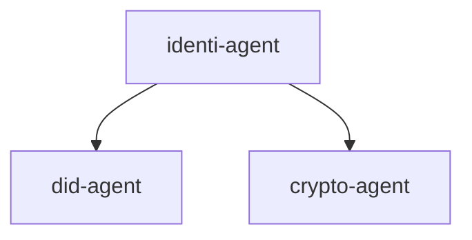
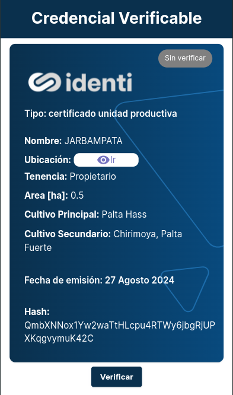

# Identi Agent

This repository contains the source code for the IDENTI Self-Sovereign Identity project.

# Overview

This documentation provides an overview of the core concepts and components used in our Self-Sovereign Identity (SSI) service. We leverage the Veramo framework, Decentralized Identifiers (DIDs), and Verifiable Credentials (VCs) to build a secure, decentralized identity solution.

## What is a Veramo Agent?

A Veramo Agent is a software entity responsible for managing DIDs, Verifiable Credentials (VCs), and other SSI-related operations. It acts as an interface between decentralized identity components and the applications using them. The Veramo framework provides the tools and libraries necessary to create and interact with these agents, enabling the management of identity data in a decentralized manner.

## Key Features of Veramo Agent:

- DID Management: Creates, resolves, and manages DIDs.
- VC Handling: Issues, verifies, and stores Verifiable Credentials.
- Interoperability: Supports multiple DID methods and VC formats.
- Extensibility: Easily integrates with various plugins to extend functionality.

## What is a DID?

A Decentralized Identifier (DID) is a globally unique identifier that does not require a central authority for its issuance or management. DIDs are a key component of SSI, enabling users to own and control their digital identities. Each DID is associated with a set of cryptographic keys and metadata, which are used to authenticate and verify the identity of the DID owner.

## Principles of DIDs:

- **Access:** users must have access to their own data.
- **Consent:** users must give prior consent for the use of their identity by third parties.
- **Control:** users must be able to control their identities.
- **Existence:** users must have an independent existence.
- **Interoperability:** identities must be widely usable.
- **Minimization:** the disclosure of claims must be minimized.
- **Persistence:** identities must be durable.
- **Protection:** users' rights must be protected.
- **Portability:** identity information and services must be portable.
- **Transparency:** systems and algorithms must be transparent.

## DID Method:

We're using **did:ethr** method, which is a DID implementation on the Ethereum blockchain. This method allows DIDs to be managed using Ethereum smart contracts, leveraging the decentralized nature of the Ethereum network.

## What is a Verifiable Credential (VC)?

A Verifiable Credential (VC) is a digital statement issued by a trusted entity (issuer) about a subject (holder). VCs are tamper-evident and cryptographically secure, making them an essential part of SSI. They can represent any type of information, such as identity, qualifications, or attributes, and are easily verifiable by third parties.

> We're using Verifiable Credentials v1.1 [link](https://www.w3.org/2018/credentials/v1).

## Key Features of VCs:

- **Tamper-Proof:** Protected against unauthorized modifications.
- **Interoperable:** Can be used across different platforms and ecosystems.
- **Privacy-Preserving:** Allows selective disclosure of information.
- **Trustworthy:** Issued by verified and trusted authorities.

## Oblivious Decentralized Identifier Service (ODIS)

We're using the ODIS to provide a privacy-preserving way to identify which DID belongs to a user without anyone knowing.

To know more about ODIS, please check the [ODIS documentation](https://docs.celo.org/protocol/identity/odis).

> **Note:** We're using CELO network for this service.

### How it works:

```javascript
// Initialize the class

const obfuscateIdentifierResource = new ObfuscateIdentifierResource({
  privateKey: config.CELO_PRIVATE_KEY,
  nodeUrl: config.CELO_NODE_URL,
});

// Obfuscate a new identifier
await obfuscateIdentifierResource.registerAttestation(
  '0x0344309....'
  'identifier',
);
```

# Project structure

This repository is structured as follows:

- [identi-agent](packages/identi-agent/README.md): This package does expose all APIs for communication with DID and Crypto agents.
- [did-agent](packages/did-agent/README.md): This package is responsible of managing DIDs.
- [crypto-agent](packages/crypto-agent/README.md): This package handles all crypto operations.
- [identi-front](packages/identi-front/README.md): Front-end to display Verifiable Credentials.

<div align="center">



</div>

## Tech requirements

Minimum versions required:

- [docker](https://www.docker.com/): v27.1.1
- [docker-compose](https://docs.docker.com/compose/): v2.29.1

## Build Identi Agent locally

## Configure environment

### Initial configurations

First of all, you need to configure the environment variables for each package. To do this, you need to copy the `.env.example` file to a new `.env` file for each package.

```bash
cp packages/did-agent/.env.example packages/did-agent/.env

cp packages/crypto-agent/.env.example packages/crypto-agent/.env

cp packages/identi-agent/.env.example packages/identi-agent/.env

cp packages/identi-front/.env.example packages/identi-front/.env
```

Configure each `.env` file with the correct values.

> **Note:** In the **identi-agent** `.env` file, the variables `IDENTI_DID` and `IDENTI_DID_KID` will be configured in the [Configure issuer DID](#configure-issuer-did) section. (Do it after the project is running).

## Run project

To build the project locally, you need to run the following command:

```bash
docker compose up --build
```

## Configure issuer DID

You need to create a DID for the issuer. You can do this by running the following command:

Replace `AGENT_API_KEY`, `IDENTI_DID_ALIAS` and `DID_PROVIDER` with the respective values defined in the **did-agent** `.env` file.

```bash
export AGENT_API_KEY="secret"
export IDENTI_DID_ALIAS="did-identi"
export DID_PROVIDER="did:ethr:celo"

docker exec -it identi-agent-did-agent-1 /bin/bash -c "curl -X 'POST' \
  'http://localhost:3331/agent/didManagerCreate' \
  -H 'accept: application/json; charset=utf-8' \
  -H 'Authorization: Bearer $AGENT_API_KEY' \
  -H 'Content-Type: application/json' \
  -d '{
\"alias\": \"$IDENTI_DID_ALIAS\",
  \"provider\": \"$DID_PROVIDER\",
  \"kms\": \"local\"
}'"
```

Response:

```json
{
  "did": "did:ethr:celo:0x0344309....",
  "controllerKeyId": "04443090bb3a475f5daaf593f7bac6af5f....",
  "keys": [
    {
      "type": "Secp256k1",
      "kid": "...",
      "publicKeyHex": "...",
      "meta": {
        "algorithms": [
          "ES256K",
          "ES256K-R",
          "eth_signTransaction",
          "eth_signTypedData",
          "eth_signMessage",
          "eth_rawSign"
        ]
      },
      "kms": "local"
    }
  ],
  "services": [],
  "provider": "did:ethr:celo",
  "alias": "did-identi"
}
```

Copy the value of `did` to `IDENTI_DID` and `controllerKeyId` to `IDENTI_DID_KID` in the **identi-agent** `.env` file.

> **Note:** Restar the did-agent container to apply the changes.

## How to Issue a Verifiable Credential (VC)

To issue a Verifiable Credential (VC), the following steps are taken:

Go to [Identi Agent Docs](http://localhost:3330/docs)

### 1. Create a JWT using your `JWT_HASH_KEY` in the **identi-agent** `.env` file.

### 2. Create a new DID

Use the endpoint `/did` to create a new DID.

```json
{
  "identifiers": ["string"]
}
```

### 3. Issue a Verifiable Credential

Use the endpoint `/did/verifiable_credentials/issue` to issue a Verifiable Credential.

```json
{
  "identifier": "string",
  "credential_subject": {
    "name": "string",
    "email": "string",
    "phone": "string",
    "address": "string"
  },
  "credential_type": "PersonalCredential",
  "valid_period": "1y",
  "is_return_hash": false
}
```

## View Verifiable Credentials on Identi Front



## Utils

### Create a new `AGENT_SECRET_KEY`

```bash
docker exec -it identi-agent-did-agent-1 /bin/bash -c "yarn veramo config create-secret-key"
```

### ¡Happy coding!
