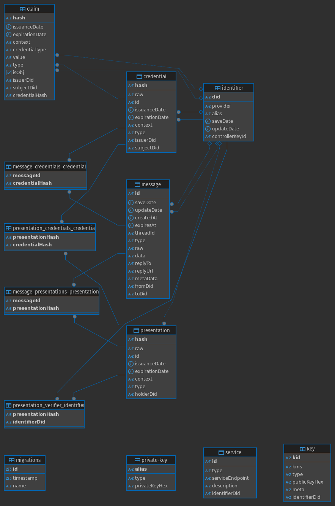

# Installation

## Tech requirements

Minimum versions required:

- [docker](https://www.docker.com/): v27.1.1
- [docker-compose](https://docs.docker.com/compose/): v2.29.1
- [PostgreSQL](https://www.postgresql.org/): v11.2

## Configure environment

Configure the environment variables. You need to copy the `.env.example` file to a new `.env`.

```bash
cp .env.example .env
```

## Run project

To run the project locally, you need to run the following command:

```bash
docker compose up --build
```

## Configure `SECRET_KEY`

Database uses `SECRET_KEY` to encrypt private keys. You need to create a new Secret Key using the next command and replace `SECRET_KEY` with the new value.

```bash
yarn veramo config create-secret-key
```

You can execute the command in the container:

```bash
docker exec -it identi-nodes-organization_node-1 /bin/bash -c "yarn veramo config create-secret-key"
```

> **Note:** When you generate a new `SECRET_KEY`, you need to restart the container to apply the changes.

> **Note:** When a private key is generated, it is stored in the database. So, you can't change the value of `SECRET_KEY` after the first time because the private key is encrypted with the old `SECRET_KEY` value and you can't decrypt it.

You can go to [/api-docs](http://localhost:3330/api-docs) to see the API Swagger documentation if the endpoint `/api-docs` is available.

## Database

After running the project, you will see the following database schema in the database that you configured in the `.env` file.


