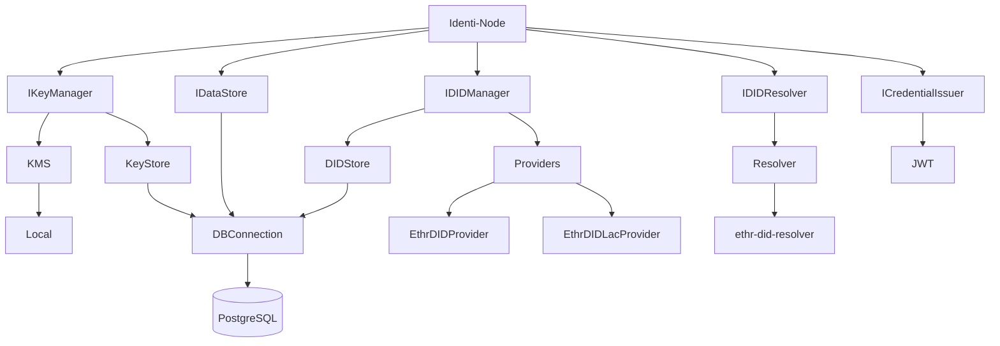

# Introduction

## What is a Veramo Agent?

A Veramo Agent is a software responsible for managing DIDs, Verifiable Credentials (VCs), and other SSI-related operations. It acts as an interface between decentralized identity components and the applications using them. The Veramo framework provides the tools and plugins necessary to create and interact with these agents, enabling the management of identity data in a decentralized manner.

## Key Features of Veramo Agent:

- DID Management: Creates, resolves, and manages DIDs.
- VC Handling: Issues, verifies, and stores Verifiable Credentials.
- Interoperability: Supports multiple DID methods and VC formats.
- Extensibility: Easily integrates with various plugins to extend functionality.

## What is a DID?

A Decentralized Identifier (DID) is a globally unique identifier that does not require a central authority for its issuance or management. DIDs are a key component of SSI, enabling users to own and control their digital identities. Each DID is associated with a set of cryptographic keys and metadata, which are used to authenticate and verify the identity of the DID owner.

## Principles of DIDs:

- **Access:** users must have access to their own data.
- **Consent:** users must give prior consent for the use of their identity by third parties.
- **Control:** users must be able to control their identities.
- **Existence:** users must have an independent existence.
- **Interoperability:** identities must be widely usable.
- **Minimization:** the disclosure of claims must be minimized.
- **Persistence:** identities must be durable.
- **Protection:** users' rights must be protected.
- **Portability:** identity information and services must be portable.
- **Transparency:** systems and algorithms must be transparent.

## DID Method:

We're using **did:ethr** method, which is a DID implementation on the Ethereum blockchain. This method allows DIDs to be managed using Ethereum smart contracts, leveraging the decentralized nature of the Ethereum network.

## What is a Verifiable Credential (VC)?

A Verifiable Credential (VC) is a digital statement issued by a trusted entity (issuer) about a subject (holder). VCs are tamper-evident and cryptographically secure, making them an essential part of SSI. They can represent any type of information, such as identity, qualifications, or attributes, and are easily verifiable by third parties.

> We're using Verifiable Credentials v1.1 [link](https://www.w3.org/2018/credentials/v1).

## Key Features of VCs:

- **Tamper-Proof:** Protected against unauthorized modifications.
- **Interoperable:** Can be used across different platforms and ecosystems.
- **Privacy-Preserving:** Allows selective disclosure of information.
- **Trustworthy:** Issued by verified and trusted authorities.

# Project structure

## Plugins

### Key manager

The KeyManager plugin is responsible for managing keys and signing operations. It uses a KeyStore to store keys and a KMS to sign operations.

### Data store

The DataStore plugin is responsible for storing data. It uses a DIDStore to store DIDs.

### DID manager

The DIDManager plugin is responsible for managing DIDs. It uses a DIDStore to store DIDs and a DIDResolver to resolve DIDs.

### DID resolver

The DIDResolver plugin is responsible for resolving DIDs.

### CredentialIssuer

The CredentialIssuer plugin is responsible for issuing credentials.

### EthrDIDLacProvider (TDD)

The EthrDIDLacProvider plugin is responsible to DIDs on the LACCHAIN network.
