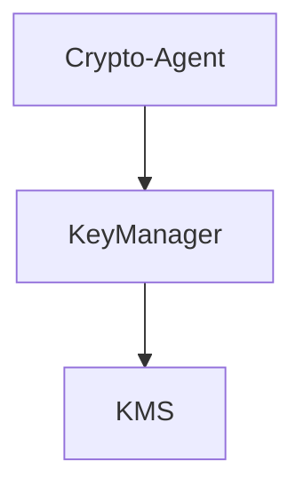

# Crypto Agent

## Structure

This repository use the following Veramo plugins:

## Plugins

### Key manager

The KeyManager plugin is responsible for managing keys and signing operations. It uses a KeyStore to store keys and a KMS to sign operations.

## Network

We're using `CELO` network to do all our transactions.
