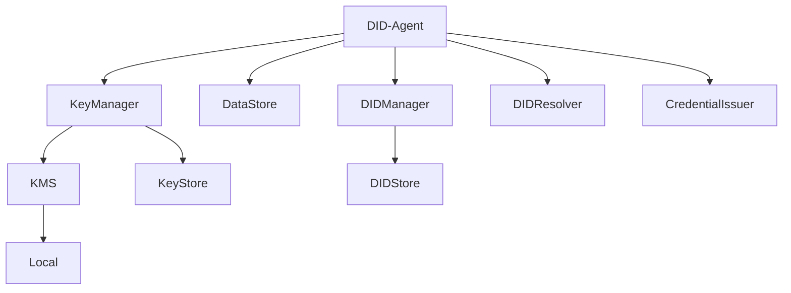

# DID Agent

## Structure

This repository use the following Veramo plugins:

## Plugins

### Key manager

The KeyManager plugin is responsible for managing keys and signing operations. It uses a KeyStore to store keys and a KMS to sign operations.

### Data store

The DataStore plugin is responsible for storing data. It uses a DIDStore to store DIDs.

### DID manager

The DIDManager plugin is responsible for managing DIDs. It uses a DIDStore to store DIDs and a DIDResolver to resolve DIDs.

### DID resolver

The DIDResolver plugin is responsible for resolving DIDs.

### Credential issuer

The CredentialIssuer plugin is responsible for issuing credentials.
