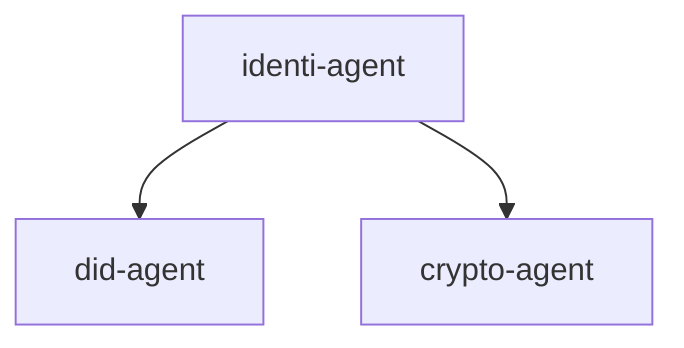

# Identi Agent

This is a monorepository for Identi Agent.

## Structure

This repository is structured as follows:

- [identi-agent](../identi-agent/README.md): This package does expose all APIs for communication with DID and Crypto agents.
- [did-agent](../did-agent/README.md): This package is responsible of managing DIDs.
- [crypto-agent](../crypto-agent/README.md): This package handles all crypto operations.

